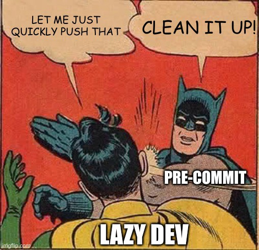
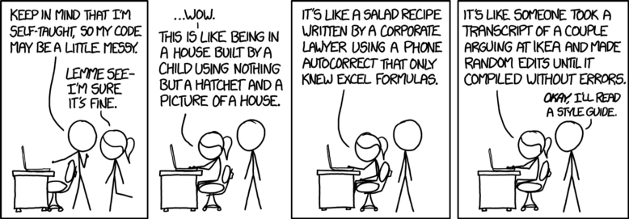

# Contributing guidelines

## Code submission process

1 . Create a *fork* on GitHub

2 . Clone your *fork* repository locally

```bash
git clone https://github.com/<GITHUB-USERNAME>/SEI_builder.git
```

3 . Make your local changes

4 . (Optional) Install pre-commit hook

5 . Test your local changes:

```bash
python -m pytest -rA .
```

6 . Pull and rebase any changes made by others to master since you started working
on your change:

```bash
git pull --rebase
```

7 . Also, if you committed multiple changes locally, squash them to a single
commit before submitting a Pull Requests (PR):

```bash
git log
# Now find the commit ID of your first local commit, and use it to rebase
git rebase <FIRST-COMMIT-ID> -i
# Now mark all of the commits except the first as "squash"
```

We prefer a single commit as the first revision of a PR, because it is cleaner
 to review.

8 . Push your changes to your fork:

```bash
# Use the -f option if you have used your fork for previous PRs
git push -f fork master
```

9 . Go to your fork on GitHub and click the link to create a new pull request.

10 . Now say that your reviewers have some feedback. Make your local changes,
rerun tests (as above), then update your fork:

```bash
git push fork master
```

 Note: Do not squash commits after the PR has been sent! This resets state held
 by GitHub about what files each reviewer has already seen, and prevents them
 from being able to see what updates you have done.

11 . Now say that more changes have been made to master, and you need to update
your fork. Pull the master changes as a merge (not a rebase!):

```bash
git pull
git push fork master
```

 By using merges instead of rebases, GitHub can actually hide away the content
 of the merge commits because the reviewer doesn't really need to see them.

12 . Now say that the reviewer has approved your change with LGTM; it's time to
submit! Use the "Squash and merge" option when merging to master. We use squash
merging because the individual PR iterations are not important to understanding
the evolution of the codebase in master, and create a lot of noise in the
commit history.

13 . If you need a deeper explenation of check the step-by-step tutorial [How to contribute on Github](https://www.dataschool.io/how-to-contribute-on-github/)


## How pre-commit

### What it is `pre-commit`?

Pre-commit hooks are a mechanism of the version control system git.
They let you execute code right before the commit performing some checking on you changes.

Besicaly force lazy developers to control his code to avoid stupid typos or style mistakes.

<p align="center">
 
</p>

### Why I should use `pre-commit`?

When you are coding it is esay following your own "style" and "logic" and some time this can result in a chaotic and hard to read code (i.e. *a Spaghetti code*).
Thus, with `pre-commit` we are trying to basically avoid the situation below:

<p align="center">
 
</p>

### How to use `pre-commit`

In the repository there is all the configuration files (`.pre-commit-config.yaml`) the only thing to do is to:

1 . Install thought pip
```bash
pip install pre-commit
```

2 . Activate it to run before `git commit`
```bash
pre-commit install
```

3 . Try it

```bash
pre-commit run
```

>⚠️HOW TO SKIP IT
>
> To commit without running the `pre-commiting`
> ```bash
> git commit --no-verify
> ```
> However will fail on the remote repository because the "Continue Integration" workflow which check all at every push and pull

**Hooks list:**

| Hook | auto-fix |
| :---: | :---: |
| [pre-commit-hooks](https://github.com/pre-commit/pre-commit-hooks) | ✅ |
| [isort](https://github.com/timothycrosley/isort) | ✅ |
| [pyupgrade](https://github.com/asottile/pyupgrade) | ✅ |
| [black](https://github.com/psf/black) | ✅ |
| [blacken-docs](https://github.com/asottile/blacken-docs) | ✅ |
| [nbQA](https://github.com/nbQA-dev/nbQA) | ✅ and ❌ |
| [flake8](https://gitlab.com/pycqa/flake8) | ❌ |

>NB: that many of the hook can "auto-fix" your code, thus if stop try to re-run `git commit`
>and the hook will pass successfully!
