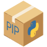

<h1 align="center">
    SEI Builder
    <br>
    <picture>
      <source
        srcset="img/logo_dark.png"
        media="(prefers-color-scheme: dark)">
      
    </picture>
</h1>

<h3 align="center">
A set of Jupyter notebooks to build and study battery aging.
</h3>

<p align="center">
    <a target="_blank" href="https://python.org">
    </a>
    <a target="_blank" href="https://jupyter.org">
    </a>
    <!---
    # TODO set LICENSE
    <a target="_blank" href="/LICENSE">
    </a>
    -->
    <a target="_blank" href="https://www.linux.org/">
    </a>
    <a target="_blank" href="/CONTRIBUTING.md">
    </a>
    <a target="_blank" href="https://github.com/psf/black">
    </a>
</p>

<p align="center">
    <a target="_blank" href="https://github.com/features/actions">
    </a>
    <a target="_blank" href="https://github.com/DAP93/SEI_builder/actions/workflows/liter.yml">
    </a>
        <a target="_blank" href="https://results.pre-commit.ci/latest/github/DAP93/SEI_builder/main?badge_token=zRcWs0cGTEaB1hO3Co5J9g">
    </a>
    <a target="_blank" href="https://www.codacy.com?utm_source=github.com&amp;utm_medium=referral&amp;utm_content=paolodeangelis/SEI_builder&amp;utm_campaign=Badge_Grade">
    </a>
</p>

<p align="center">
    <a target="_blank" href="http://img.shields.io/badge/DOI-to%20define-blue.svg">
    </a>
</p>

## Table of contents

-   [🎉 Installation](#-installation)
    -   [ Using `pip`](#using-pip)
    -   [ Using `conda`](#using-conda)
    -   [Clone `lammps_wrapper` *Submodule* [temporary]](#clone-lammps-wrapper-submodule)
    -   [Install `packmol`](#install-packmol)
    -   [Configure `MPInterface`](#configure-mpinterface)

-   [🚀 Usage](#-examples)

-   [😍 Contributing](#-contributing)

-   [🚩 License](#-license)

-   [🎖️️️ CREDITS](#-creditscreditsmd)

## 🎉 Installation

### <a name="using-pip" />  Using `pip`

<details>

#### Clone repository

```shell-session
git clone https://github.com/DAP93/SEI_builder.git
```

#### Set-up virtual environment (optional)

1.  create a virtual environment `venv_sei`

```shell-session
# python3 -m venv <Virtual environment name>
python3 -m venv venv_sei
```

2.  activate it
```shell-session
source venv_sei/bin/activate
```

#### Install dependencies

1.  move in the *SEI Builder* folder
```shell-session
cd SEI_builder
```

2.  downlaod and install the requiremnts with `pip` (Package Installer for Python)
```shell-session
pip install -r requirements.txt
```

3.  check if all the jupyter widget are working:

```shell-session
jupyter labextension list
# JupyterLab v3.1.17
# /.../venv_sei/share/jupyter/labextensions
#        nglview-js-widgets v3.0.1 enabled OK
#        jupyterlab-plotly v5.3.1 enabled OK
#        @jupyter-widgets/jupyterlab-manager v3.0.1 enabled OK (python, jupyterlab_widgets)
#        @bokeh/jupyter_bokeh v3.0.4 enabled OK (python, jupyter_bokeh)
```

if the line `nglview-js-widgets v3.0.1 enabled OK` is missing, run the following command:

```shell
$ pip install --force-reinstall nglview
```

</details>

### <a name="using-conda" />  Using `conda`

<details>

#### Clone repository

```shell-session
git clone https://github.com/DAP93/SEI_builder.git
```

#### <a name="set-up-virtual-environment-conda" /> Set-up virtual environment (optional)

1.  create a virtual environment `venv_sei` using environment file `environment.yml`

```shell-session
conda env create -f SEI_builder/environment.yml
```

2.  activate it
```shell-session
conda activate venv_sei
```

#### Install dependencies

> NOTE: if you made the virtual environment following the [previous step](#set-up-virtual-environment-conda)
> you can skip this step.

1.  move in the *SEI Builder* folder
```shell-session
cd SEI_builder
```

2.  downlaod and install the requiremnts with `pip` (Package Installer for Python)

```shell-session
pip install -r requirements.txt
```

3.  check if all the jupyter widget are working:

```shell-session
jupyter labextension list
# JupyterLab v3.1.17
# /.../venv_sei/share/jupyter/labextensions
#        nglview-js-widgets v3.0.1 enabled OK
#        jupyterlab-plotly v5.3.1 enabled OK
#        @jupyter-widgets/jupyterlab-manager v3.0.1 enabled OK (python, jupyterlab_widgets)
#        @bokeh/jupyter_bokeh v3.0.4 enabled OK (python, jupyter_bokeh)
```

if the line `nglview-js-widgets v3.0.1 enabled OK` is missing, run the following command:

```shell-session
$ pip install --force-reinstall nglview
```

</details>

### <a name="clone-lammps-wrapper-submodule" /> Clone `lammps-wrapper` *Submodule* [temporary]

The `lammps-wrapper` developend is ongoing and stil not yet published on [Pypi](https://pypi.org/) repository.
To get the last updated download it with the following command.

```shell-session
git submodule update --init
```
### <a name="install-packmol" /> Install `packmol`

1.  Clone from repository
```shell-session
git clone https://github.com/m3g/packmol.git
```

2.  Compile it
```shell-session
cd packmol
make
```

3.  (optional) create a symbolic link to local `bin` folder

```shell-session
ln -s $(pwd)/packmol /home/$USER/.local/bin/packmol
```


### <a name="configure-mpinterface" /> Configure `MPInterface`

#### Get *Material Project* API key

Access to [Material Project](https://materialsproject.org/) and follow the istruction on the [documentation](https://docs.materialsproject.org/open-apis/the-materials-api/#api-keys)

#### Make the configuration file

1. Run the script replacing `<MATERIAL_PROJECT_KEY>` with the API key got in the [previus step](#configure-mpinterface).

```shell-session
python3 mpinterfaces_setup.py -k <MATERIAL_PROJECT_KEY>
```

## 🚀 Usage

## 😍 Contributing

We highly welcome contributions!

There is a lot to do:

-   add new example
-   improve functions
-   fix bugs

But first read the [**Contributing guidelines**](CONTRIBUTING.md).

## 🚩 License
The code is available under the [MIT license](LICENSE).

## 🎖️️️ [CREDITS](CREDITS.md)

<hr width="100%">
<p align="right">
    <em><strong>Acknowledgements:</strong></em>
    &nbsp;
    <a target="_blank" href="https://www.big-map.eu/">
        
    </a>
    &nbsp;
    <a target="_blank" href="https://areeweb.polito.it/ricerca/small/">
        
    </a>
    &nbsp;
    <a target="_blank" href="https://www.polito.it/">
        
    </a>
</p>
