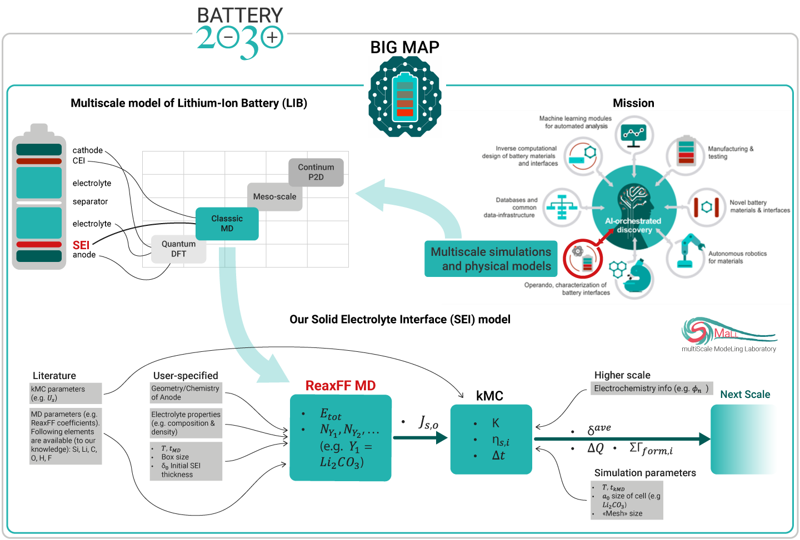

.. SEI Builder documentation master file, created by
   sphinx-quickstart on Fri Apr  8 01:23:19 2022.
   You can adapt this file completely to your liking, but it should at least
   contain the root `toctree` directive.

.. Links:

.. _BIG-MAP: https://www.big-map.eu/
.. _SMaLL: https://areeweb.polito.it/ricerca/small/

.. image:: https://app.codacy.com/project/badge/Grade/7c4a93b7223e491a8d48322ba0ee8d04
   :target: https://www.codacy.com?utm_source=github.com&amp;utm_medium=referral&amp;utm_content=paolodeangelis/SEI_builder&amp;utm_campaign=Badge_Grade

.. .. image:: https://img.shields.io/badge/license-GNU%20GPLv3-green  # TODO define a LICENSE
..      :target: https://github.com/paolodeangelis/SEI_builder/blob/main/LICENSE
..      :alt: License - GNU GPLv3

.. image:: https://zenodo.org/badge/479131818.svg
   :target: https://zenodo.org/badge/latestdoi/479131818

SEI Builder
===========

*SEI* stand for: "Solid Electrolyte Interface".

   A solid electrolyte interphase (SEI) is generated on the anode of lithium-ion batteries during the first few
   charging cycles. The SEI provides a passivation layer on the anode surface, which inhibits further electrolyte
   decomposition and affords the long calendar life required for many applications.
   However, the SEI remains poorly understood.

   -- :footcite:t:`heiskanen2019generation`

This app is an ASE-base workflow used to reproduce a rational initial SEI morphology at the atomic scale by
stochastically placing the crystal grains of the inorganic salts formed during the SEI's reaction.

This workflow is part of the European project Battery Interface Genome - Materials Acceleration Platform (`BIG-MAP`_).
And it is a portion of a more wide workflow to analyze the formation and growth of the Solid Electrolyte Interface (SEI)
at the atomistic level by using several atomistic simulations (:numref:`fig_framework`).

.. _fig_framework:

         Research framework overview.

How to cite
===========
.. TODO add article

If you use the SEI Builder for your work, please cite this repository:

.. tabs::

   .. tab:: BibTex

      BibTex entry for the Github repository:

      .. code-block:: BibTeX

         @misc{MPInterface,
         title        = {SEI Builder - Jupyter notebooks to build inital SEI morphology.},
         author       = {De Angelis, Paolo and Cappabianca, Roberta and Asinari, Pietro and Chiavazzo, Eliodoro},
         year         = 2022,
         publisher    = {GitHub},
         journal      = {GitHub repository},
         howpublished = {\url{https://github.com/paolodeangelis/SEI_builder}},
         url          = {https://github.com/paolodeangelis/SEI_builder},
         doi          = {10.5281/zenodo.6470785}
         }

   .. tab:: RIS

      RIS entry for the Github repository:

      .. code-block:: Text

         TY  - COMP
         AU  - De Angelis, Paolo
         AU  - Cappabianca, Roberta
         AU  - Asinari, Pietro
         AU  - Chiavazzo, Eliodoro
         DA  - 2022///
         DO  - 10.5281/zenodo.6470785
         ID  - MPInterface
         LB  - MPInterface
         PB  - GitHub
         TI  - SEI Builder - Jupyter notebooks to build inital SEI morphology.
         UR  - https://github.com/paolodeangelis/SEI_builder
         ER  -

.. toctree::
   :maxdepth: 4
   :glob:
   :caption: Getting Started

   ./pages/installation/*
   ./pages/usage/*

.. toctree::
   :maxdepth: 2
   :glob:
   :caption: API Documentation

   ./pages/api/index.rst

Authors
=======

Paolo De Angelis

Roberta Cappabianca

Pietro Asinari

Eliodoro Chiavazzo

If you liked our work check out out team `SMaLL`_

Indices and tables
==================

* :ref:`genindex`
* :ref:`modindex`
* :ref:`search`

------------

.. footbibliography::
