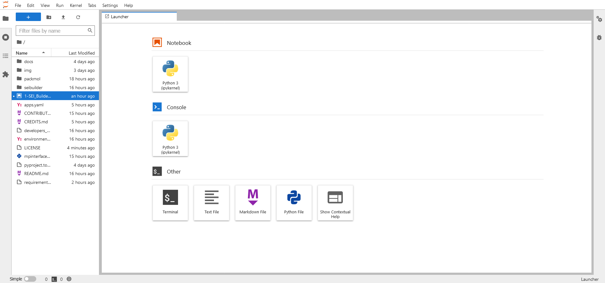
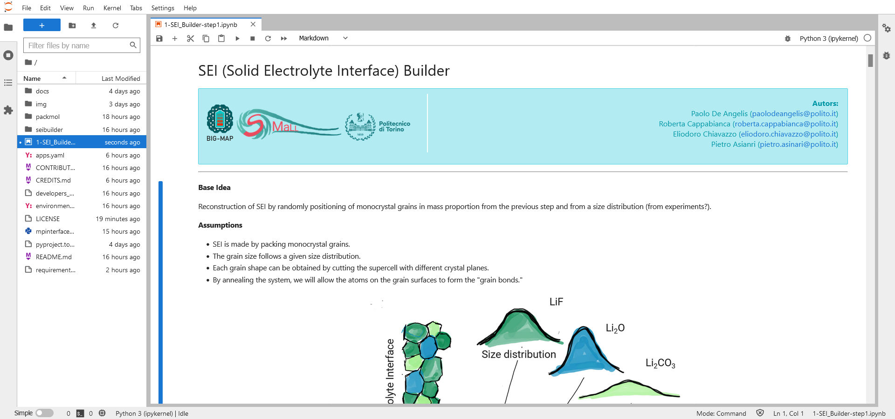

.. Links:

.. _JupyterLab documentation: https://jupyterlab.readthedocs.io/en/stable/index.html

Usage
=====

The workflow can be run interactively using the web-based interactive development environment ``JupyterLab``

Start ``JupyterLab``
--------------------

Start JupyterLab using:

.. code-block:: shell-session

    $ jupyter lab

.. _fig_jupyterhome:

         JupyterLab web interface

For more option to control your interface check `JupyterLab documentation`_

Run the workflow
----------------

#. Open the notebook ``1-SEI_Builder-step1.ipynb`` (:numref:`fig_jupyter_nb_step1`).

#. Follow and execute all *text* blocks (with the explanations) and the *code* blocks.

.. _fig_jupyter_nb_step1:

         View of ``1-SEI_Builder-step1.ipynb`` in JupyterLab
